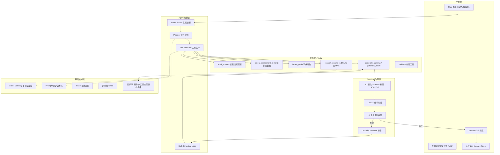
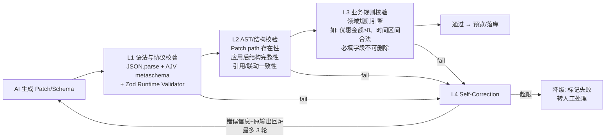

# AI Configuration Platform 技术方案
## —— 自然语言驱动 JSON Schema 配置的 AI Agent 架构设计

> 适用场景：营销低代码平台（优惠券、商品特价等数十类活动配置）的 AI Native 升级。
> 本文档同时对齐当前 demo 工程（React + RJSF + Monaco + AJV）的落地实现。

---

## 1. 目标与设计原则

### 1.1 目标

| 目标 | 说明 |
|------|------|
| 自然语言生成 | 用户描述需求 → 自动生成表单 Schema / 流程节点 |
| 自然语言增量修改 | 在已有配置上做局部修改，输出 JSON Patch 而非全量重写 |
| 产线级可靠性 | AI 输出必须通过多层校验才能进入生产，一次生成通过率 90%+ |
| 平台化复用 | AI 能力以插件形式接入，可复用到招商活动、选投平台等其他低代码场景 |

### 1.2 核心设计原则

1. **增量优先（Patch over Rewrite）**：修改场景一律生成 RFC 6902 JSON Patch。
   - 全量重写的问题：token 消耗大、无关字段可能被"顺手改坏"、diff 不可控、无法审计。
   - Patch 的收益：变更范围最小化、可逐条校验、可逐条回滚、天然形成审计日志。
2. **工具编排替代直接生成（Agent over One-shot LLM）**：复杂配置不靠一次 prompt 生成，而是让 Agent 通过工具读取 Schema、查元数据、定位节点后再生成，降低幻觉。
3. **不信任模型输出（Zero-trust Output）**：所有 AI 输出视为不可信输入，必须经过 Guardrail 流水线才能落库。
4. **无侵入接入（Plugin Architecture)**：AI 能力与低代码平台解耦，平台只需实现协议适配器即可接入。

---

## 2. 总体架构



### 2.1 端到端流程（一次"增量修改"请求）

```
用户: "把年龄字段的最大值改成 65，再加一个手机号字段，必填，11 位数字"

1. Intent Router   → 判定为 MODIFY（增量修改），而非 CREATE / QUERY / EXPLAIN
2. Planner         → 拆解为两个子任务: ①修改 age.maximum ②新增 phone 字段
3. Tool: read_schema        → 获取当前 Schema（大 Schema 时返回摘要+按需展开）
4. Tool: locate_node        → 定位 /properties/age，确认 maximum 当前值
5. Tool: query_component_meta → 查询"手机号"组件协议（pattern、ui:widget 等规范）
6. Tool: generate_patch     → LLM 生成 JSON Patch（结构化输出）
7. Guardrail L1~L3          → Patch 语法 → 应用后 Schema 结构 → 业务规则
8. (若失败) Self-Correction → 携带错误信息回炉重生成，最多 N 轮
9. 前端 Monaco Diff 预览    → 用户确认 → apply_patch → 版本落库
```

生成的 Patch 示例：

```json
[
  { "op": "replace", "path": "/properties/age/maximum", "value": 65 },
  { "op": "add", "path": "/properties/phone", "value": {
      "type": "string", "title": "手机号", "pattern": "^1[3-9]\\d{9}$"
  }},
  { "op": "add", "path": "/required/-", "value": "phone" }
]
```

---

## 3. Context Engineering

上下文构建是准确率的第一决定因素。Context 由**静态领域知识**和**动态会话上下文**两部分组装，按优先级注入并控制 token 预算。

### 3.1 Context 组装结构

```
┌─────────────────────────────────────────────┐
│ System Prompt（角色 + 平台协议约束 + 输出格式） │  ← 静态，版本化管理
├─────────────────────────────────────────────┤
│ 领域知识（按需注入）                           │
│  - 平台 Schema 元协议（字段类型/联动/校验规范）  │
│  - 相关组件协议（只注入本次涉及的组件）          │  ← query_component_meta 按需拉取
├─────────────────────────────────────────────┤
│ Few-shot 示例（RAG 检索 Top-K）               │
│  - 用户意图 → 相似历史配置/Patch 对             │  ← 向量检索，按意图类型分桶
├─────────────────────────────────────────────┤
│ 当前配置上下文                                 │
│  - 小 Schema: 全量注入                        │
│  - 大 Schema: 骨架摘要（节点树+字段名+类型），   │
│    细节通过 locate_node 工具按需展开            │
├─────────────────────────────────────────────┤
│ 会话历史（多轮修改的对话记忆，滑动窗口+摘要压缩）  │
├─────────────────────────────────────────────┤
│ 用户当前指令                                   │
└─────────────────────────────────────────────┘
```

### 3.2 关键技术点

- **Schema 摘要（Skeleton）**：营销活动 Schema 可达数百行，全量注入既浪费 token 又稀释注意力。将 Schema 压缩为「路径 + 类型 + title」的骨架树注入，例如：

  ```
  /properties/name         string   "姓名" required
  /properties/age          integer  "年龄" [0,120]
  /properties/isStudent    boolean  "我是学生" → 联动 dependencies
  ```

  模型需要细节时通过 `locate_node` 工具展开局部子树。这是 Agent 模式相比 one-shot 的核心优势之一。

- **Few-shot 检索策略**：历史配置和 Patch 记录经 embedding 入向量库，检索键 =「用户指令 + 意图类型」，按意图分桶（新增字段 / 修改校验 / 配置联动 / 流程节点），保证示例与当前任务同构。上线初期用人工精选的 20~50 条黄金示例冷启动。

- **组件协议按需注入**：平台数十类组件（日期选择、级联、金额输入……）的协议全部注入会撑爆上下文。由 Intent Router 提取实体（"手机号"→ PhoneInput 组件），只注入命中的组件协议。

---

## 4. Agent 与 Tool Calling 设计

### 4.1 为什么用 Agent 而不是单次生成

| 维度 | One-shot LLM | Agent + Tools |
|------|-------------|---------------|
| 大 Schema | 全量塞入 prompt，易超限/幻觉 | 摘要 + 按需读取 |
| 字段规范 | 靠 prompt 里堆规则，易漏 | 查元数据工具，返回权威协议 |
| 修改定位 | 模型猜 path，易错 | locate_node 确定性定位 |
| 可维护性 | prompt 越写越长 | 能力工具化，独立迭代测试 |

### 4.2 工具清单

| 工具 | 输入 | 输出 | 实现方式 |
|------|------|------|---------|
| `read_schema` | scope（可选路径） | Schema 全量/骨架/子树 | 确定性代码 |
| `locate_node` | 自然语言描述或字段名 | 候选 JSON Pointer 列表+置信度 | 规则匹配 + 模糊搜索（字段名/title 双索引） |
| `query_component_meta` | 组件名/别名 | 组件协议（props、校验规则、ui:widget） | 元数据注册中心查询 |
| `search_examples` | 用户指令 | Top-K 相似配置示例 | 向量检索 |
| `generate_schema` | 需求描述 + context | 完整 Schema（新建场景） | LLM 结构化输出 |
| `generate_patch` | 修改描述 + 目标节点 | RFC 6902 Patch 数组 | LLM 结构化输出 |
| `validate` | Schema 或 Patch | 校验结果 + 结构化错误 | 确定性代码（Guardrail 流水线） |
| `dry_run_apply` | Patch | 应用后的 Schema 预览 | 确定性代码 |

设计要点：
- **生成类工具（LLM）与确定性工具（代码）分离**。定位、校验、应用这些有确定答案的事绝不交给模型，模型只负责"理解意图 + 生成变更"。
- 工具输出统一为结构化 JSON，错误信息面向模型可读（供 Self-Correction 使用）。

### 4.3 编排策略

- **Intent Router 前置**：先用轻量模型（或规则）分类 CREATE / MODIFY / QUERY / EXPLAIN，不同意图走不同的工具链和 prompt 模板，避免大而全的单 Agent。
- **受控循环**：采用 ReAct 风格但限制步数（如 ≤8 步），每步工具调用记录 trace；超步数则降级为"生成草稿 + 人工确认"。
- **结构化输出**：generate_patch 使用 function calling / JSON mode 强约束输出格式，配合 Zod schema 定义输出契约，从源头减少格式错误。

---

## 5. Guardrail 四层治理体系

核心思想：**校验器是确定性代码，修复者才是模型**。"生成 → 校验 → 修复"闭环。



### L1 语法与协议校验（毫秒级，拦截 ~60% 错误）

- JSON 可解析性；
- Patch 数组符合 RFC 6902 格式（op/path/value 合法）；
- 应用后的 Schema 通过 **AJV 元校验**（是合法的 JSON Schema draft）；
- **Zod Runtime Validator** 校验平台扩展协议：平台私有字段（如 `ui:widget`、组件 props）用 Zod 定义 runtime schema，逐字段校验并产出结构化错误路径。

### L2 AST / 结构校验

把 Schema 当 AST 遍历，校验语法层面查不出的结构问题：
- Patch 的 `path` 在当前 Schema 中真实存在（add 除外）、`remove` 不会悬空引用；
- `required` 中的字段在 `properties` 中存在；
- `dependencies` / `oneOf` 联动引用的字段存在且类型匹配；
- 枚举 default 值在 enum 集合内；数值 min ≤ max；
- 组件树嵌套深度、字段命名规范（camelCase、无中文 key）。

### L3 业务规则校验

领域规则引擎，规则由各业务线以插件注册：
- 营销约束：优惠金额 > 0、活动时间不早于当前、库存字段与 SKU 组件必须成对出现；
- 安全约束：AI 不允许删除标记为 `protected` 的字段、不允许修改资金相关字段的校验规则（只能收紧不能放宽）；
- 权限约束：当前用户角色可操作的组件白名单。

### L4 Self-Correction（自修复闭环）

- 任一层失败，将**结构化错误**（错误码、路径、期望值、实际值）+ 原始输出拼入修复 prompt，要求模型只修错误点；
- 每轮修复后重新走完整校验流水线；
- 最多 3 轮（可配置），修复率与轮次收益递减，超限降级人工；
- 所有修复轨迹落 trace，失败 case 自动进入评测集作为回归样本。

**效果指标口径**：一次生成通过率 = L1~L3 首轮全通过 / 总请求；最终通过率 = 含 Self-Correction 后通过 / 总请求。

---

## 6. 平台化插件架构

AI 能力对低代码平台**无侵入**：平台不感知模型细节，AI 侧不耦合具体业务 Schema。

### 6.1 部署形态与前后端分工

整体形态 = **前端 npm SDK（嵌入宿主平台页面） + 后端独立 Agent 服务（各平台共用）**。

```
┌─────────────────────────── 浏览器 ────────────────────────────┐
│  宿主平台页面（营销低代码 / 招商 / 选投，各自已有的 Web 应用）      │
│  ┌──────────────────┐      ┌───────────────────────────────┐ │
│  │ 平台自己的低代码编辑器│ ⇄回调⇄│ @ai-config/sdk-react (npm 包) │ │
│  │ (Schema 状态持有者) │      │ Chat 面板 / Diff 预览 / Patch  │ │
│  └──────────────────┘      │ 勾选 / dry-run 渲染            │ │
│                            └──────────────┬────────────────┘ │
└───────────────────────────────────────────┼──────────────────┘
                             HTTPS + SSE 流式│（会话协议）
┌───────────────────────────────────────────▼──────────────────┐
│              AI Configuration Service（独立后端服务）           │
│  Session Manager │ Intent Router │ Planner │ Tool Executor    │
│  Guardrail Pipeline │ Model Gateway │ Prompt Registry │ Trace │
│  ┌─────────────────── Adapter SPI ───────────────────┐        │
│  │ 营销平台 Adapter │ 招商平台 Adapter │ 选投平台 Adapter │        │
│  └───────┬──────────────────┬──────────────┬─────────┘        │
└──────────┼──────────────────┼──────────────┼──────────────────┘
           ▼                  ▼              ▼
     营销平台后端服务      招商平台后端服务   选投平台后端服务
     (配置读写/元数据)     (配置读写/元数据)  (配置读写/元数据)
           │
           ▼
   知识库（向量库 / Prompt / 评测集，按 platformId 隔离 namespace）
```

**分工原则：模型、知识、规则在后端；状态、交互、确认在前端。**

| 职责 | 归属 | 理由 |
|------|------|------|
| LLM 调用、API Key、Model Gateway | 后端 | 密钥安全、成本管控、多模型路由 |
| Agent 编排循环、工具执行 | 后端 | 需要访问元数据服务/向量库；循环步数与超时集中管控 |
| Guardrail L1~L4 | 后端为准 | 校验规则是安全边界，不能只在前端做（前端可被绕过） |
| L1 语法校验 | 前端**冗余**一份 | AJV/Zod 是同构 JS，前端先跑一遍可在 apply 前即时反馈，省一次往返 |
| 当前草稿 Schema 状态 | 前端 | 用户正在编辑、未保存的最新态只存在于浏览器（见 6.4） |
| Diff 预览、逐条 Patch 勾选、人工确认 | 前端 | 交互层 |
| Patch 的最终 apply 与版本落库 | 后端（经 Adapter） | 乐观锁、审计日志、inverse patch 快照 |

### 6.2 前端形态：npm 包，而不是独立 Web 页面

选择 **npm SDK** 而非独立站点，核心原因：AI 配置能力必须出现在**用户正在编辑配置的那个页面里**（编辑器旁边的侧栏），拿得到编辑器的实时草稿状态、改完立即在原页面预览生效。独立 Web 页面做不到这两点，还会带来跨站状态同步和登录态问题。

SDK 分两层，兼顾"快速接入"与"深度定制"：

- **`@ai-config/core`（headless）**：会话管理、SSE 流解析、Patch 本地 dry-run/apply、L1 前置校验。不含 UI，任何框架可用；
- **`@ai-config/sdk-react`**：开箱即用的 React 组件（Chat 面板、Diff 视图、Patch 勾选列表），基于 core 封装。宿主平台如果是 Vue，可只用 core 自己包一层 UI。

宿主平台接入方式——通过 props 注入回调，SDK 不直接触碰宿主的状态管理：

```tsx
<AIConfigPanel
  platformId="marketing"            // 决定后端走哪个 Adapter、哪套知识库
  configId={activityId}             // 已保存配置的定位标识
  getCurrentSchema={() => editorStore.schema}   // ① 拉取宿主编辑器的草稿态
  getSchemaVersion={() => editorStore.version}  // ② 乐观锁版本号
  onPatchApplied={(patched, patch) =>           // ③ AI 修改确认后回写宿主编辑器
    editorStore.setSchema(patched)}
  renderPreview={(schema) =>                    // ④ 可选：用宿主自己的渲染器做预览
    <PlatformFormRenderer schema={schema} />}
  auth={{ getToken }}                           // 复用宿主登录态
/>
```

关键点：**SDK 只通过 `getCurrentSchema` / `onPatchApplied` 两个回调与宿主交换数据**，宿主编辑器始终是 Schema 状态的唯一持有者（single source of truth），AI 侧不维护第二份可编辑状态，避免双写不一致。

### 6.3 Agent 服务端架构

Agent 是**有状态会话服务**，一次自然语言请求在服务端的完整时序：

```
POST /v1/sessions/{sid}/messages   (body: 用户指令 + 草稿 Schema 或 schemaHash)
  │
  ├─ 1. Session Manager: 恢复/更新会话快照（Schema snapshot + 对话历史）
  ├─ 2. Intent Router:   小模型/规则分类 → MODIFY，提取实体["年龄","手机号"]
  ├─ 3. Context Builder: 骨架摘要 + 命中的组件协议 + RAG few-shot（按 platformId 检索）
  ├─ 4. Agent Loop (≤8 步):
  │      ├─ tool: locate_node("/properties/age")     ← 作用于会话快照
  │      ├─ tool: query_component_meta("手机号")      ← 经 Adapter 查平台元数据服务
  │      └─ tool: generate_patch(...)                ← Model Gateway → LLM
  ├─ 5. Guardrail Pipeline: L1→L2→L3，失败则 L4 Self-Correction 回到 4
  └─ 6. SSE 流式返回: 过程事件(tool_call/thinking) + 最终事件(patch + dry-run 结果)
       ── 此时 Patch 只是"提案"，尚未落库 ──

POST /v1/sessions/{sid}/apply      (body: 勾选的 patch 子集 + baseVersion)
  └─ 重跑 Guardrail（防前端绕过）→ Adapter.applyPatch(乐观锁) → 版本快照 + inverse patch
```

架构上的三个要点：

1. **会话即快照**：每个 session 在服务端（Redis）持有一份 Schema 快照，Agent 的所有读类工具（`read_schema`/`locate_node`/`dry_run_apply`）都作用于快照而非直接打平台接口，保证一次会话内工具看到的 Schema 一致，也隔离了平台服务的读压力；
2. **生成与落库分离**：`messages` 接口只产出 Patch 提案，`apply` 是独立接口且服务端重跑 Guardrail——人工确认环节插在两者之间，AI 从架构上就没有"直接写生产"的路径；
3. **无状态可水平扩展**：会话状态外置 Redis，Agent 服务本身无状态；LLM 长耗时用 SSE 流式吐过程事件，避免前端长轮询。

### 6.4 Agent 如何获取"当前 JSON"

这是接入设计里最容易踩坑的一点，因为**存在两份 Schema**：数据库里已保存的版本，和用户正在编辑器里改、尚未保存的草稿。Agent 必须基于草稿工作，否则会在旧数据上生成 Patch。取数走两条链路：

| 链路 | 场景 | 机制 |
|------|------|------|
| ① 前端上推（主链路） | 用户在编辑器中有未保存修改 | SDK 通过 `getCurrentSchema()` 回调从宿主编辑器取草稿，随会话请求上传；服务端存为会话快照 |
| ② 后端回源 | 会话初始化无草稿 / 引用其他配置 / apply 前校验基线 | `Adapter.readConfig(configId, version)` 从平台后端服务读取已保存版本 |

一致性保障：

- **hash 比对省流量**：每轮消息前端只带 `schemaHash`（草稿的内容 hash），与服务端快照一致则不重传；用户在会话期间手动改了编辑器，hash 不一致，SDK 自动重传全量草稿并刷新快照；
- **apply 用乐观锁**：`apply` 携带 `baseVersion`（发起会话时的已保存版本号），Adapter 落库时比对，版本落后则拒绝并提示"配置已被他人修改"，前端重新拉取后可让 Agent 基于新版重生成；
- **大 Schema 不重复传**：快照建立后，Agent 循环内的多次工具调用（定位、展开子树、dry-run）全部在服务端快照上进行，不产生前后端往返。

### 6.5 "复用于招商活动、选投平台"的实现机制

复用的本质：**Kernel 里没有任何一行营销业务代码**——所有平台差异都被收敛到三个扩展点，接新平台 = 填充这三个扩展点，不改 Kernel。

**扩展点一：后端 Adapter SPI**（平台差异的唯一代码入口）

```typescript
interface PlatformAdapter {
  /** 领域知识：Schema 元协议 + 组件注册表 */
  getProtocolSpec(): ProtocolSpec;
  getComponentMeta(name: string): ComponentMeta;
  /** 配置读写（对接平台自己的后端服务） */
  readConfig(id: string, version?: string): JsonSchema;
  applyPatch(id: string, patch: JsonPatch[], baseVersion: string): ApplyResult;
  /** 业务规则（L3 Guardrail 插件） */
  getBusinessRules(): Rule[];
  /** Few-shot 数据源 */
  getExampleCorpus(): ExampleSource;
}
```

Adapter 按 `platformId` 注册进 Kernel；Agent 的工具实现全部面向 SPI 编程（如 `query_component_meta` 内部就是 `adapter.getComponentMeta()`），因此工具、编排、Guardrail 流水线、Self-Correction 逻辑对所有平台**零修改复用**。

**扩展点二：知识与配置资产**（按 `platformId` 隔离 namespace，无代码）

- Prompt Registry：每个平台一套 prompt 模板变体（复用基座模板 + 覆写平台协议描述段）；
- 向量库：few-shot 语料按平台分 namespace，检索互不污染；
- 评测集：每平台独立评测集，接入验收和回归各跑各的；
- L3 规则：业务规则以声明式 DSL/插件注册，招商平台注册"招商保证金 > 0"，选投平台注册自己的选品约束。

**扩展点三：前端 SDK 接入**（宿主平台改动 < 50 行）

新平台前端只需安装 npm 包、挂载 `<AIConfigPanel>`、实现 `getCurrentSchema`/`onPatchApplied` 两个回调（6.2 节）。Chat、Diff、勾选、流式渲染全部由 SDK 提供。

**新平台接入 Checklist**（对应"接入成本 < 1 人周"的验收口径）：

| 步骤 | 工作量 |
|------|--------|
| 1. 实现 PlatformAdapter（6 个方法，对接自家元数据/配置服务） | 2~3 天 |
| 2. 注册 L3 业务规则 | 0.5 天 |
| 3. 灌注 few-shot 语料（20~50 条历史配置） + 建评测集 | 1 天 |
| 4. 前端挂载 SDK + 两个回调 | 0.5 天 |
| 5. 跑评测集验收（通过率达标才放量） | 0.5 天 |

### 6.6 关键问题：各平台 Schema 协议不同，凭什么能复用？

不同平台的协议方言确实不同（营销用 JSON Schema + `ui:widget` 扩展，招商/选投可能是自定义节点树 DSL）。方案**不走"统一各平台 DSL"路线**——强行统一是有损的且推动成本极高——而是承认方言差异，用"变与不变"分层吸收：

**不变（Kernel 复用，协议无关的"过程能力"）：**
- Agent 编排骨架：意图识别 → 规划 → 工具循环 → 生成 → 校验 → 自修复；
- JSON Patch 机制：RFC 6902 作用于**任意 JSON 文档**，不要求是标准 JSON Schema；
- Guardrail 的阶段结构（L1→L4）与 Self-Correction 闭环；
- 会话快照、乐观锁、Trace、评测框架。

**变（协议知识降级为"数据"，由 Adapter 注入，不写死在 Kernel 代码里）：**

| 协议差异 | 吸收点 |
|---|---|
| 字段类型体系、私有扩展方言 | `getProtocolSpec()` 协议描述，按请求动态注入 Context |
| 组件集合不同 | `getComponentMeta()` 各平台组件注册表 |
| 校验规则不同 | L1 Zod validator + L3 业务规则均由 Adapter 注册 |
| 模型该模仿的示例不同 | few-shot 语料按 platformId 分 namespace |

**Kernel 的三个最小假设**：配置是一个 JSON 文档、有一份机器可读的协议描述、有一组可执行的校验器。满足即可接入。

**适用边界**：若平台 DSL 与 JSON Schema 差异极大但仍是 JSON 结构（如节点树），Patch 与流水线依然成立，差异由协议描述和校验器吸收；若配置根本不是 JSON（XML/专有格式），需 Adapter 额外做双向格式转换投影成 JSON 再进 Kernel。

**为什么不做统一中间表示（IR）**：IR 需为所有平台能力做并集建模，任何平台新增特性都要动 IR，中心化瓶颈比方言隔离更贵；且 IR↔平台 DSL 的双向转换本身是新的错误源。

**协议注入 Context 不等于模型会遵守**：协议遵守最终由 Guardrail 确定性校验器保证，Context 注入只为提高一次通过率——"生成靠模型、正确性靠代码"。

### 6.7 工程化基础设施

| 模块 | 职责 |
|------|------|
| Model Gateway | 多模型路由（按任务复杂度分级：意图识别用小模型，生成用大模型）、超时/重试/熔断、成本统计 |
| Prompt Registry | Prompt 模板版本化、灰度发布、A/B 对比 |
| Trace | 每次请求全链路记录：意图→工具调用→生成→校验→修复→最终结果，支持回放 |
| Evals | 评测集（指令, 初始 Schema, 期望 Patch）三元组；CI 上跑回归，Prompt/模型变更必须过评测 |

---

## 7. 前端交互设计（对齐当前 demo 工程）

当前 demo 已有：Monaco Schema 编辑器 + RJSF 实时渲染 + AJV 校验。AI 能力叠加为：

1. **Chat 侧栏**：自然语言输入，流式返回 Agent 的执行过程（正在读取 Schema → 定位节点 → 生成修改…），增强可解释性与信任感；
2. **Diff 确认**：AI 生成 Patch 后，用 Monaco DiffEditor 展示修改前后对比，同时右侧 RJSF **实时渲染 patch 后的表单预览**（dry_run），用户看到的是"表单长什么样"而不只是 JSON diff；
3. **逐条 Patch 勾选**：多个修改点可单独接受/拒绝；
4. **一键回滚**：每次 apply 生成版本快照，支持回退到任意版本（Patch 天然可逆：记录 inverse patch）。

### demo 落地技术选型

| 能力 | 选型 |
|------|------|
| Patch 生成/应用 | `fast-json-patch`（apply、validate、逆向 patch） |
| L1 校验 | `ajv`（已有）+ `zod`（平台扩展协议） |
| Diff 展示 | `@monaco-editor/react` DiffEditor（已有依赖） |
| LLM 调用 | Model Gateway 封装 OpenAI 兼容接口，function calling 输出 Patch |
| 渲染 | `@rjsf/core`（已有） |

---

## 8. 关键风险与应对

| 风险 | 应对 |
|------|------|
| 模型幻觉出不存在的字段/组件 | locate_node + query_component_meta 提供权威事实源；L2 存在性校验兜底 |
| 大 Schema 上下文超限 | 骨架摘要 + 按需展开；修改场景只注入目标子树 |
| Patch 应用顺序问题（前一条 add 影响后一条 path） | dry_run 逐条顺序应用校验；生成时要求模型按依赖排序 |
| 并发修改冲突 | applyPatch 携带版本号，乐观锁；冲突时重新读取并重生成 |
| 恶意/越权指令（prompt injection） | L3 权限白名单 + protected 字段策略；AI 无删除生产配置的直接权限，一律走人工确认 |
| 效果回归 | 评测集 + trace 回放；失败 case 自动沉淀为回归样本 |

---

## 9. 实施路线

| 阶段 | 范围 | 验收标准 |
|------|------|---------|
| P0 MVP（2~3 周） | 单表单场景：NL→生成/修改 Schema，L1+L2 校验，Diff 确认 | 黄金评测集 30 条通过率 ≥ 80% |
| P1 产线化（4~6 周） | Agent 工具编排、L3 业务规则、Self-Correction、版本回滚、Trace | 一次通过率 ≥ 90%，P95 延迟 < 15s |
| P2 平台化（持续） | 插件协议、多平台接入、Prompt/模型 A/B、评测 CI | 第二个业务平台接入成本 < 1 人周 |

---

## 10. 面试答辩要点（Q&A 备忘）

- **为什么用 JSON Patch 不用全量生成？** → 见 1.2；补充：全量生成在 500 行 Schema 上 token 成本 ~10x，且无关字段变更率显著；Patch 可逐条校验、可逆、可审计。
- **为什么 Agent 不直接一次生成？** → 大 Schema 摘要+按需读取解决上下文问题；确定性工具（定位/元数据）消除幻觉源头；能力工具化便于独立测试迭代。
- **通过率 90%+ 怎么度量？** → 评测集 + 线上口径（L1~L3 首轮全通过率），Self-Correction 前后分别统计。
- **Zod 和 AJV 分工？** → AJV 校验"输出是合法 JSON Schema"（元校验）；Zod 校验平台私有协议扩展（ui:widget、组件 props 等 TS 生态友好、错误信息结构化，直接喂给 Self-Correction）。
- **如何防止 AI 改坏生产配置？** → 四层 Guardrail + protected 字段 + 人工确认 + 版本回滚 + inverse patch，AI 全程无直接写生产权限。
- **前端是 npm 包还是独立页面？** → npm SDK（headless core + React 组件层）。AI 面板必须嵌在用户正在编辑的页面里才能拿到草稿态、改完原地预览；独立站点做不到且有登录态/状态同步问题。见 6.2。
- **Agent 怎么拿到当前 JSON？** → 双链路：草稿态由前端 `getCurrentSchema()` 回调上推、服务端建会话快照（hash 比对省流量）；已保存版本由后端经 `Adapter.readConfig` 回源。apply 带 baseVersion 乐观锁防并发覆盖。见 6.4。
- **"复用到招商/选投平台"具体怎么实现？** → Kernel 零业务代码，平台差异收敛到三个扩展点：后端 Adapter SPI（元数据/读写/规则）、按 platformId 隔离的知识资产（prompt/向量库/评测集）、前端 SDK 两个回调。接入新平台不改 Kernel，成本 < 1 人周。见 6.5。
- **Guardrail 在前端还是后端？** → 以后端为准（安全边界，前端可被绕过，apply 时服务端重跑）；L1 语法校验因 AJV/Zod 同构在前端冗余一份做即时反馈。
- **各平台 Schema 协议不同，怎么复用？** → 不统一 DSL，承认方言差异：过程能力（Agent 编排、Patch、Guardrail 流水线）协议无关、Kernel 复用；协议知识（协议描述、组件元数据、校验器、few-shot 语料）降级为数据、由 Adapter 注入并按 platformId 隔离。Kernel 只做三个最小假设：是 JSON 文档、有协议描述、有校验器。不做统一 IR 是因为并集建模成本和双向转换错误源都更贵。见 6.6。
